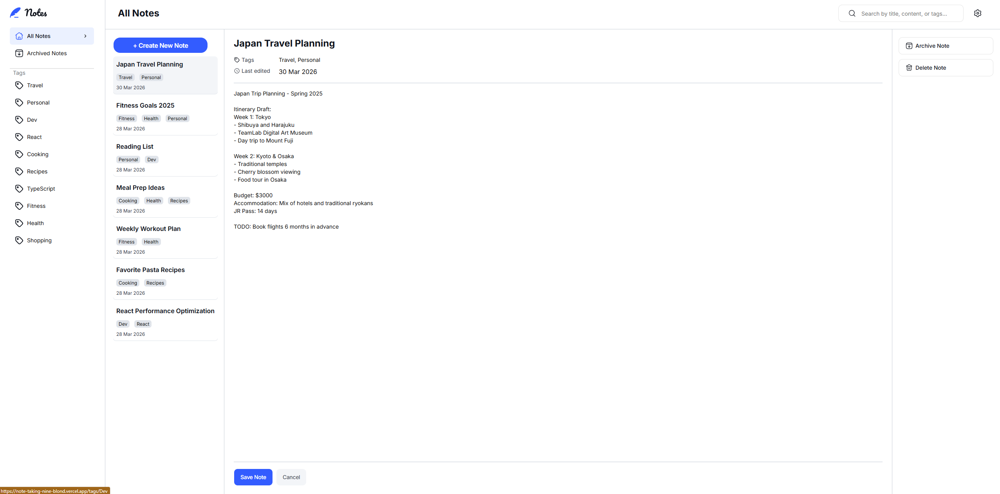

Note-taking web app solution

## Table of contents

- [Overview](#overview)
  - [The challenge](#the-challenge)
  - [Screenshot](#screenshot)
  - [Links](#links)
- [My process](#my-process)
  - [Built with](#built-with)
  - [What I learned](#what-i-learned)
  - [Continued development](#continued-development)
- [AI Collaboration](#ai-collaboration)
- [Author](#author)

---

## Overview

### The challenge

Users should be able to:

- ✅ Create, read, update, and delete notes
- ✅ Archive notes
- ✅ View all their notes
- ✅ View all archived notes
- ✅ View notes with specific tags
- ✅ Search notes by title, tag, and content
- ✅ Select their color theme
- ✅ Select their font theme
- ✅ Receive validation messages if required form fields aren't completed
- ✅ Navigate the whole app and perform all actions using only their keyboard
- ✅ View the optimal layout depending on their device's screen size
- ✅ See hover and focus states for all interactive elements
- ✅ **Bonus**: Save details to a database (full-stack app)
- ✅ **Bonus**: Create an account, log in, change password (authentication)
- ❌ **Bonus**: Reset their password (forgot password flow)

### Screenshot

### Links

- Live Site: [note-taking-nine-blond.vercel.app](https://note-taking-nine-blond.vercel.app)
- GitHub: [github.com/Dev-EthanR/note-taking](https://github.com/Dev-EthanR/note-taking)

---

## My process

### Built with

- **Framework**: Next.js 16 (App Router), TypeScript
- **Styling**: Tailwind CSS v4, shadcn/ui, clsx
- **Forms**: React Hook Form, Zod
- **Auth**: Auth.js v5 — credentials (email/password) + Google OAuth, bcrypt, JWT sessions
- **Database**: PostgreSQL (Neon serverless), Prisma ORM
- **State**: URL as source of truth, React state for local UI
- **Deployment**: Vercel

### What I learned

**Credentials auth end to end** — building a full credentials auth flow from scratch using Auth.js v5, bcrypt password hashing, and JWT session callbacks was the most significant new skill from this project. Understanding the difference between OAuth (where the provider handles identity) and credentials (where you own the full flow — hashing on register, comparing on login, putting the database ID on the session) gave me a much clearer mental model of how auth actually works.

**Prisma UPSERT** — using `upsert` to handle create-or-update in a single DB operation, particularly for the settings model where a user may or may not have existing settings. Cleaner than a find-then-create pattern.

**`useLayoutEffect` over `useEffect` for visual sync** — discovered that `useEffect` causes a visible flash when syncing state that affects what's rendered. Using `useLayoutEffect` runs synchronously after DOM mutations but before the browser paints, eliminating the flicker entirely when updating the active note title in the preview list.

**Debounce as a custom hook** — extracted debouncing logic into a `useDebounce` hook that can be reused across the app. Understanding when to reach for a custom hook — when `useState` and `useEffect` combine to do one specific, reusable thing — was a key architectural lesson.

**Zod `.refine()`** — using Zod's `refine` method for cross-field validation (confirming passwords match, new password differs from old) rather than handling it manually in submit logic.

**`clsx` for conditional classes** — using `clsx` to manage conditional Tailwind class logic cleanly, avoiding messy template literal strings for dynamic styling.

**shadcn/ui customisation pattern** — the correct approach is to leave shadcn source files untouched for structural changes and customise via `className` props, but editing the source directly is fine and expected when adding new variants via `cva`.

**URL as single source of truth** — an early bug had both `activeId` state and the URL tracking which note was open, causing them to conflict. The fix was eliminating the state entirely and deriving everything from `useSearchParams`. One source of truth eliminates an entire class of bugs.

### Continued development

- **Auto-save with debounce** — Notion-style saving that fires after the user stops typing, with optimistic UI and a "saving..." indicator
- **Note version history** — append-only snapshots on each save so users can restore previous versions
- **Forgot password flow** — email-based password reset using Resend
- **Performance** — PostgreSQL full-text search with `tsvector` and GIN indexes instead of basic `contains` queries
- **Keyboard navigation** — full keyboard accessibility for all note actions

---

## AI Collaboration

This project was built with Claude (Anthropic) used throughout as a senior development collaborator — not for generating code, but for architectural discussion, code review, and debugging.

**How it was used:**

- **Architecture decisions** — discussing trade-offs before writing code (JWT vs database sessions, server components vs client components, URL as source of truth vs local state)
- **Code review** — regular reviews of components and API routes with feedback on edge cases, security issues, and refactoring opportunities
- **Debugging** — working through specific errors together, understanding root causes rather than just applying fixes
- **Refactoring guidance** — identifying when components were doing too much and planning extractions (custom hooks, smaller components, shared utilities)

**What worked well:**

Using Claude as a sounding board rather than a code generator meant the decisions were understood, not just copied. When bugs appeared (like the `activeId` state vs URL conflict), the debugging process built genuine intuition rather than just fixing the symptom.

**What didn't work:**

Early on, reaching for state too quickly before checking if the data already existed elsewhere (in the URL, in props). This is a habit being actively corrected.

---

## Author

- GitHub: [@Dev-EthanR](https://github.com/Dev-EthanR)
